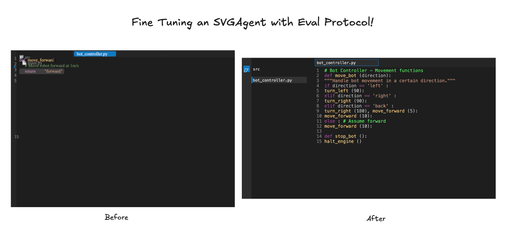
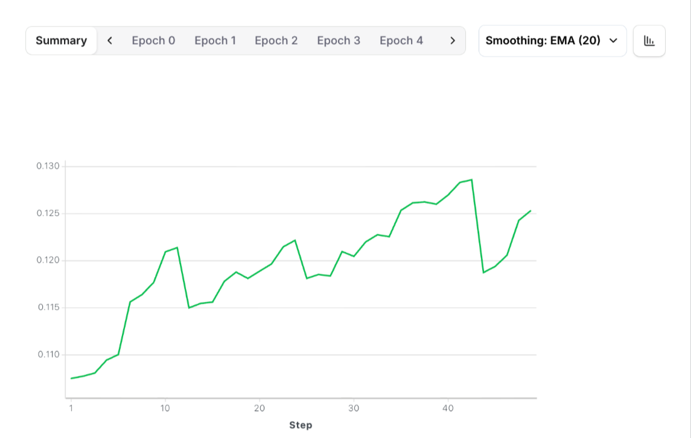
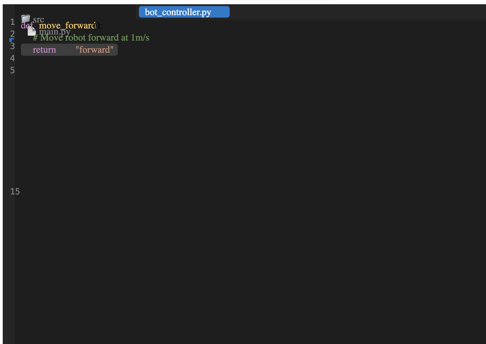
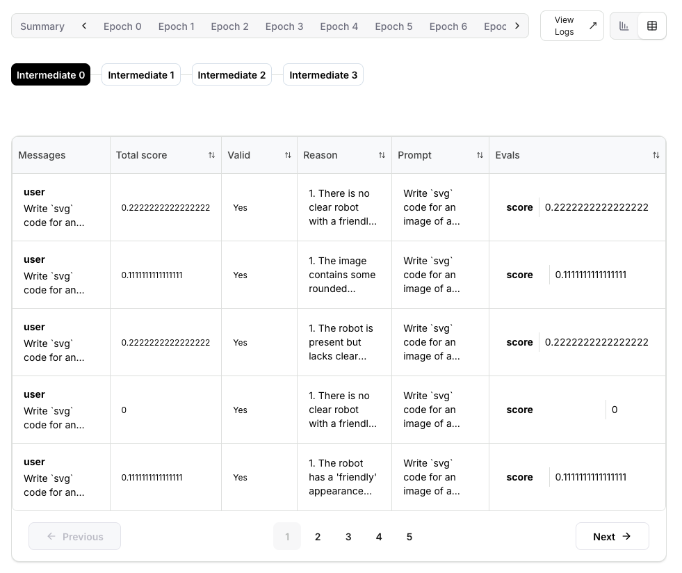
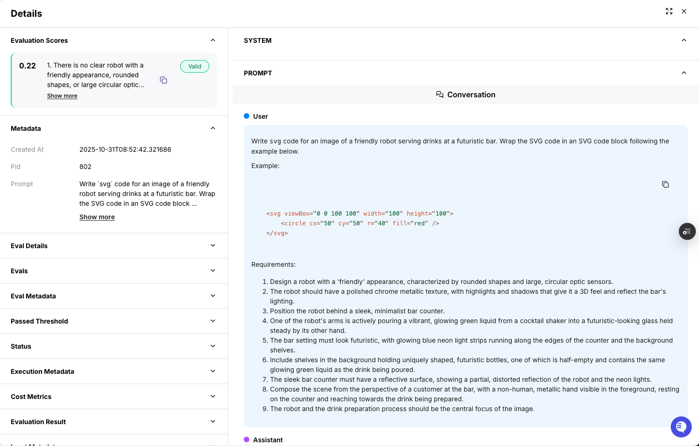
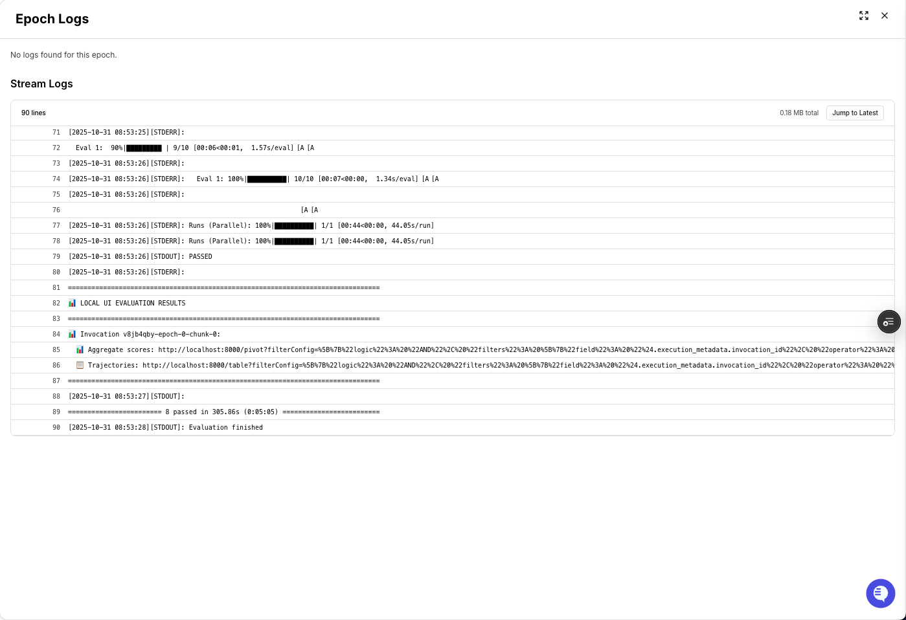

<h1 align="center">Fine Tuning an SVGAgent with Eval Protocol!</h1>

<p align="center">
  
</p>

<p align="center">
    Train and improve an SVG generation agent using reinforcement fine tuning with Eval Protocol.
</p>

<br/>

## Introduction

This repo demonstrates building an SVG generation agent using reinforcement fine tuning, with the parts:

- **Eval Protocol** - Orchestrates the rollout execution and evaluation framework
- **Vercel Typescript Server** - Remote server that handles SVG code generation rollouts
- **Fireworks RFT** - Reinforcement fine tuning trainer

A big thank you to [SVGBench](https://github.com/johnbean393/SVGBench) for the dataset. SVGBench is a comprehensive benchmark that evaluates language models on their ability to generate SVG code that meets specific visual requirements. Each prompt includes detailed criteria (like "draw a red circle in the top-left corner") that the generated SVG must fulfill.

**The Evaluation Process**: The model generates SVG code from text prompts, we render the SVGs to images, and then use GPT-4.1 as a visual judge to count how many requirements were fulfilled. This gives us concrete scores to measure improvement and lets you see dramatic before/after visual comparisons as your model gets better through training.

## Watch a Walkthrough

<div>
  <a href="https://www.loom.com/share/24ba433601de45ba8b63d9fb34c31fd5">
    <p>Getting Started with Eval Protocol for Reinforcement Learning 🚀 - Watch Video</p>
  </a>
  <a href="https://www.loom.com/share/24ba433601de45ba8b63d9fb34c31fd5">
    
  </a>
</div>

## Quick Start

### Installation

1. **Create a Fireworks account**: [https://app.fireworks.ai/account/home](https://app.fireworks.ai/account/home)

2. **Install Eval Protocol**:
```bash
pip install "eval-protocol[svgbench]"
```

3. **Environment Setup**:

The `env.example` file is located in the `evaluator/` directory. Make a copy of it in the same directory, name it `.env`, and fill in your API keys:

```bash
cp evaluator/env.example evaluator/.env
```

Then edit `evaluator/.env` with your API keys:

```
FIREWORKS_API_KEY=your-fireworks-key-here
OPENAI_API_KEY=your-openai-key-here
```

The create process below automatically reads and uploads these secrets to Fireworks.

4. Local dependencies for `ep local-test`. You will need one of:

Docker Desktop: https://docs.docker.com/desktop/setup/install/mac-install/

Chromium: https://www.chromium.org/getting-involved/download-chromium/

## Running Locally

**Terminal 1** - Start the local UI server to view results:

```bash
ep logs
```

**Terminal 2** - Test locally:

```bash
ep local-test
```

This command discovers and runs your `@evaluation_test` with pytest. In this case, it builds an image and runs the test in Docker, because a `Dockerfile` is present.

The test automatically uses our Vercel remote server:

```
rollout_processor=RemoteRolloutProcessor(
    remote_base_url="https://vercel-svg-server-ts.vercel.app",
)
```

If you want to use a local development Vercel server instead, see [Local Development Server](#local-development-server)

**Note:**
- If your evaluation setup has custom dependencies, for example Chromium, you will need containerize it using `Dockerfile`
  - Then, when you run `ep local-test`, we will build an image and run pytest inside Docker
- If not, `ep local-test` will just run pytest on your host machine
  - If you only have Chromium installed locally but not Docker Desktop, you can also ignore the `Dockerfile` and run on the host Python env using `ep local-test --ignore-docker`

### Expected Test Output:

Navigate to http://localhost:8000 to see the Eval Protocol UI.

```
INFO:eval_protocol.pytest.remote_rollout_processor:Found status log for rollout democratic-way-12: Rollout democratic-way-12 completed
INFO:eval_protocol.pytest.remote_rollout_processor:Found Fireworks log for rollout democratic-way-12 with status code 100.0
INFO:eval_protocol.adapters.fireworks_tracing:Successfully converted 1 traces to evaluation rows | 3/8 [00:19<00:22, 4.52s/rollout]
...
Runs (Parallel): 100%|████████████████████████████████████████████| 1/1 [00:31<00:00, 31.07s/run]
PASSED
```

<p align="center">
  
</p>

If you're interested in understanding how Remote Rollout Processing works and how it communicates with the remote server, see [How Remote Rollout Processing Works](#how-remote-rollout-processing-works).

## Single Command to Train

To kickoff training, simply do:

```bash
cd evaluator
eval-protocol create rft \
  --base-model accounts/fireworks/models/qwen3-0p6b \
  --accelerator-count 1 \
  --chunk-size 10
```

This command:
1. **🔐 Uploads Secrets** - Automatically reads your `.env` file and uploads API keys as Fireworks secrets
2. **📦 Uploads Evaluator** - Packages and uploads your evaluation code
3. **⏳ Waits for Build** - Polls evaluator status every 10 seconds until ACTIVE (timeout: 10 minutes)
4. **📊 Creates Dataset** - Automatically uploads your `svgbench_dataset.jsonl` 
5. **🚀 Launches RFT Job** - Starts reinforcement fine-tuning with your evaluator

### Configuration & Troubleshooting

**Training Parameters**: We use Eval Protocol's default values for training parameters (batch size, epochs, learning rate, LoRA rank, accelerator count, etc.). For a complete list of available RFT flags you can customize, see [Fireworks RFT Command Documentation](https://docs.fireworks.ai/tools-sdks/firectl/commands/create-reinforcement-fine-tuning-job).

**Changing Evaluators**: If you've made changes to your evaluator code and want to upload a new version:

```bash
eval-protocol create rft \
  --base-model accounts/fireworks/models/qwen3-0p6b \
  --accelerator-count 1 \
  --chunk-size 10 \
  --force
```

**Evaluator Upload Timing Out**: If your evaluator takes longer than 10 minutes to build, you'll see:

```
⏰ Timeout after 10.0m - evaluator is not yet ACTIVE

❌ Evaluator is not ready within the timeout period.
📊 Please check the evaluator status at: https://app.fireworks.ai/dashboard/evaluators/test-svgagent-test-svg-generation-evaluation
   Wait for it to become ACTIVE, then run 'eval-protocol create rft' again.
```

In this case, monitor the evaluator upload at the link, and run the command again when ACTIVE.

### Monitor Training Progress

After successful job creation, you'll see:

```
✅ Created Reinforcement Fine-tuning Job
   name: accounts/pyroworks/reinforcementFineTuningJobs/sdnld4yn

📊 Dashboard Links:
   Evaluator: https://app.fireworks.ai/dashboard/evaluators/test-svgagent-test-svg-generation-evaluation
   Dataset:   https://app.fireworks.ai/dashboard/datasets/svgbench-dataset
   RFT Job:   https://app.fireworks.ai/dashboard/fine-tuning/reinforcement/sdnld4yn
```

Click on the **RFT Job** link to view real-time training progress, epoch counts, and rollout data.

### Training Results

After successful training, you should see performance improvements reflected in the training metrics:

<p align="center">
  
</p>

### SVG Quality Improvement

You can inspect individual rollouts to see the dramatic improvement in SVG generation quality. Below is a comparison between the first epoch and the final 8th epoch:

**Before (1st Epoch):**
<p align="center">
  
</p>

**After (8th Epoch):**
<p align="center">
  
</p>

The reinforcement fine tuning process significantly improves the model's ability to generate accurate, detailed SVG graphics that better match the input descriptions.

## Debugging Tips

When your training is running, you have several powerful tools to debug and monitor your rollouts:

### Rollout Overview

Clicking on any **Epoch** or **Step** in the training dashboard, then clicking the **table icon** to the right, will show you a comprehensive table of all rollouts. It's a good high-level overview to see if any rollouts failed and for what reason.

<p align="center">
  
</p>

### Individual Rollout Details

If you click on a specific row in the rollout table, you can see exactly what the prompt was and how the model responded. You can even copy and paste out the SVG code generated and render it yourself to see what the model did. This is how we got the results above in the before and after comparison.

<p align="center">
  
</p>

### Live Log Streaming

Clicking on **View Logs** takes you to a page of logs being streamed in. Here, you can see precisely what errors are happening to the rollouts. This is useful to debug and fix any issues with your rollouts.

<p align="center">
  
</p>

## Contact Us / Learn More
- [Discord Server](https://discord.gg/mMqQxvFD9A). Come talk to us in the #eval-protocol channel!
- [Eval Protocol Documentation](https://evalprotocol.io/introduction)
- [Remote Rollout Processor Tutorial](https://evalprotocol.io/tutorial/remote-rollout-processor)
- [SVGBench Dataset](https://github.com/johnbean393/SVGBench) - The original benchmark this project is based on
- [Fireworks AI Platform](https://fireworks.ai)

## Appendix

### How Remote Rollout Processing Works

Eval Protocol enables **reinforcement learning that meets you where you are**. Instead of forcing you to rewrite your agent in a specific framework, you can implement a lightweight remote server wherever your codebase and infrastructure already live.

Your remote server is only responsible for:
- **Executing rollouts** - Run your agent logic (in this case, SVG generation from text prompts)
- **Logging to tracing** - Send structured logs to `tracing.fireworks.ai` for evaluation (see the below linked docs for more information)

In this example, we showcase a **Vercel TypeScript server** that executes single-turn SVG code generation.

> **📖 Learn More**: For a complete deep-dive into Remote Rollout Processing, see the [Remote Rollout Processor Tutorial](https://evalprotocol.io/tutorial/remote-rollout-processor).

### Local Development Server

```bash
cd vercel_svg_server_ts
vercel dev
```

Then swap out the `remote_base_url` to point to the local server you just started:
```
rollout_processor=RemoteRolloutProcessor(
    remote_base_url="http://localhost:3000",
)
```

And in a third terminal, run the evaluation:
```bash
ep local-test
```

> See [Vercel CLI documentation](https://vercel.com/docs/cli/dev) for more information on local development.